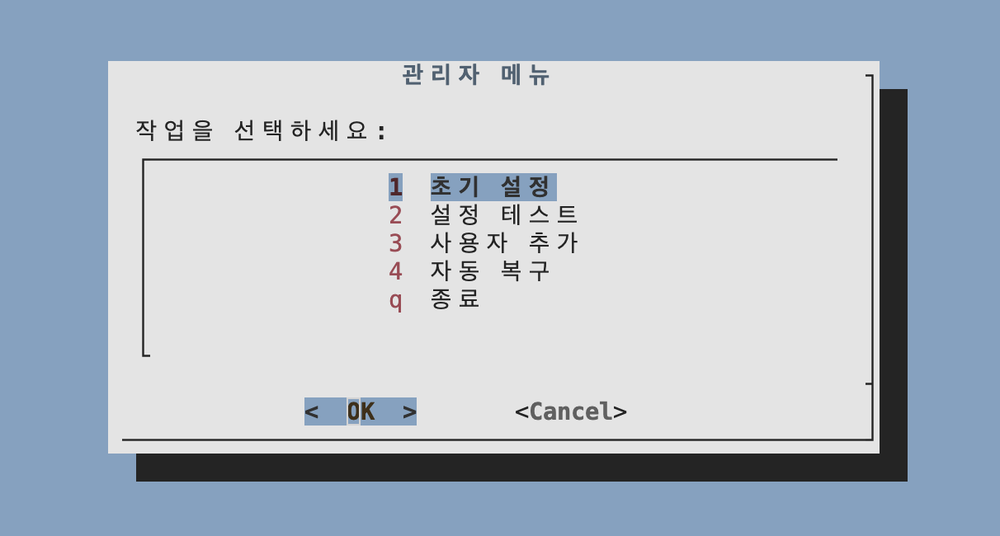
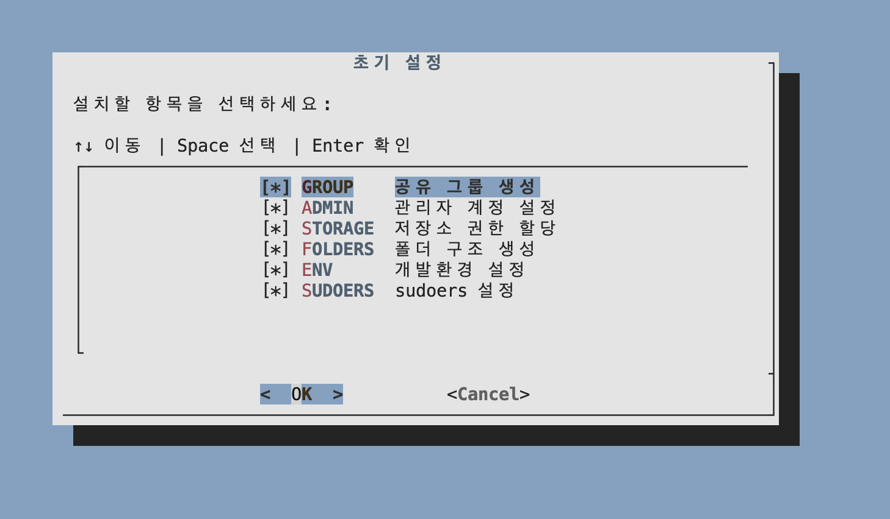
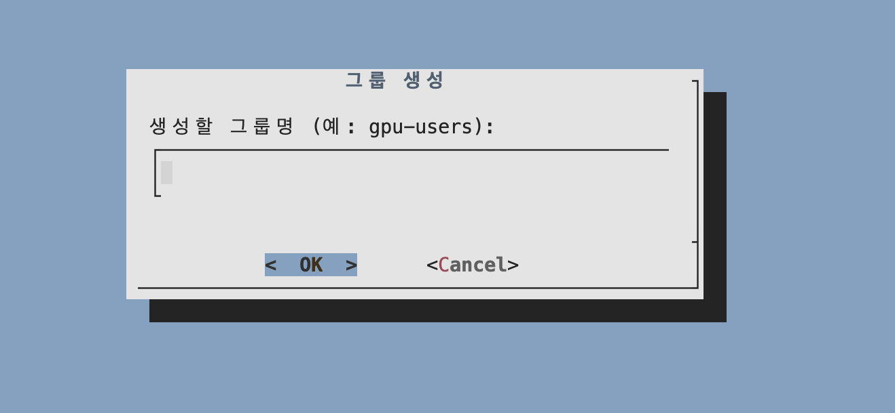
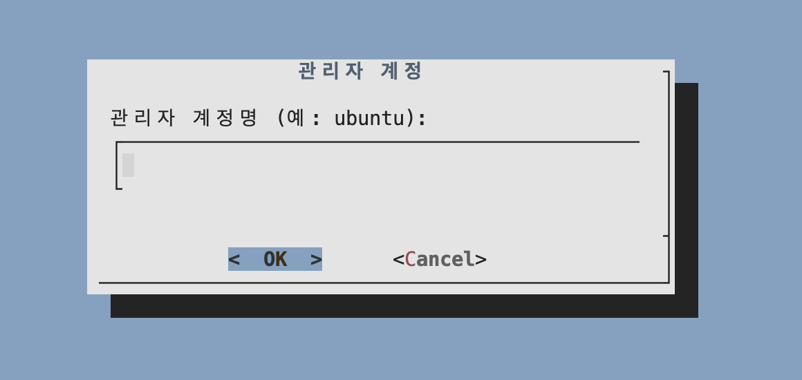
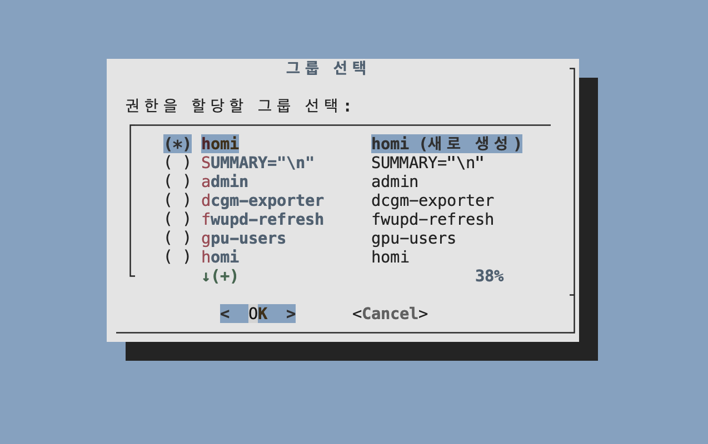
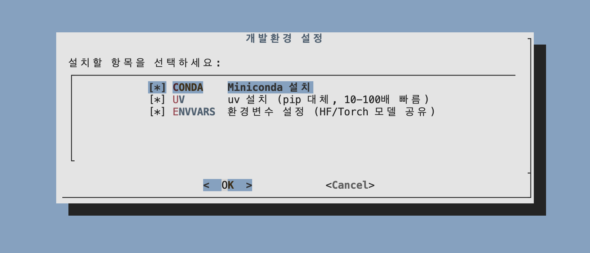

# AICADataKeeper

[](README.md)
[](README_eng.md)

> **Author**: Eungbean Lee (eungbean@homilabs.ai)  
> **Organization**: HOMI AI  
> **Version**: 2.0.0

[](LICENSE)

## 프로젝트 소개

NHN Cloud AI 서버를 위한 다중 사용자 GPU 환경 관리 시스템입니다.

**핵심 문제**: 
- SSD 200GB (휘발성, 재부팅 시 초기화)
- HDD 70TB (영구 저장, `/data` + `/backup`)

**해결 방법**:
- 사용자 홈 디렉토리를 영구 저장소로 자동 연결
- 공유 패키지 캐시로 중복 다운로드 방지
- AI 모델 중앙 관리로 디스크 공간 절약
- setgid + umask 002 조합으로 안전한 권한 관리

---

## 빠른 시작

### 1. 패키지 설치 및 저장소 클론

```bash
sudo apt install dialog 

sudo cd /data
sudo git clone https://github.com/eungbean/AICADataKeeper
sudo cd AICADataKeeper
sudo chmod +x scripts/*.sh main.sh
```

### 2. 초기 설정 위자드 실행

```bash
sudo ./main.sh
# → "1. 초기 설정" 선택
```

### 3. 다음 단계 실행 (위자드 완료 후)

```bash
# 관리자 계정으로 전환
su - $ADMIN_USER

# 그룹 멤버십 적용
newgrp $GROUP_NAME

# umask 설정 (필수!)
echo "umask 002" >> ~/.bashrc
source ~/.bashrc
# source ~/.zshrc
```

---

## 초기 설정 위자드 상세

`sudo ./main.sh` → "1. 초기 설정" 선택 시 아래 단계가 순차적으로 실행됩니다.





### 1단계: GROUP: 그룹 생성



**목적**: 모든 사용자가 공유할 Linux 그룹 생성

**수행 작업**:
```bash
groupadd <그룹명>           # 예: gpu-users
```

**결과**:
- 새 그룹이 시스템에 등록됨
- 이후 모든 사용자가 이 그룹에 추가됨

---

### 2단계: ADMIN: 관리자 계정 설정



**목적**: 서버 관리자 계정을 그룹에 추가하고 환경 설정

**수행 작업**:
```bash
# 1. 관리자를 그룹에 추가
usermod -aG <그룹명> <관리자>    # 예: usermod -aG gpu-users ubuntu

# 2. 홈 디렉토리 심볼릭 링크 생성
/home/<관리자> → /data/users/<관리자>

# 3. Conda 환경 설정
~/.condarc 생성 (공유 캐시 경로 설정)
conda init bash

# 4. 자동 복구 등록
/data/config/users.txt에 사용자 추가
```

**결과**:
- 관리자 홈이 `/data/users/`로 이동 (영구 저장)
- 서버 재부팅 후 자동 복구 대상에 포함

---

### 3단계: STORAGE: 저장소 권한 할당



**목적**: `/data` 및 `/backup` 디렉토리에 그룹 공유 권한 설정

**수행 작업**:
```bash
chown <관리자>:<그룹> /data     # 예: chown ubuntu:gpu-users /data
chmod 2775 /data               # setgid + rwxrwxr-x

chown <관리자>:<그룹> /backup   # /backup이 있는 경우
chmod 2775 /backup
```

**결과**:
| 권한 | 의미 |
|------|------|
| `2` (setgid) | 새 파일/폴더가 자동으로 그룹 소유권 상속 |
| `775` | 소유자/그룹: 읽기+쓰기+실행, 기타: 읽기+실행 |

> `/backup` 디렉토리가 없으면 자동으로 건너뜁니다.

---

### 4단계: FOLDERS: 폴더 구조 생성

**목적**: 필수 디렉토리 구조 생성 (setgid 권한 적용)

**수행 작업**:
```bash
mkdir -p /data/users                      # 사용자 홈 디렉토리
mkdir -p /data/models/huggingface/hub     # HuggingFace 모델 공유
mkdir -p /data/models/huggingface/datasets
mkdir -p /data/models/torch               # PyTorch 모델 공유
mkdir -p /data/cache/conda/pkgs           # Conda 패키지 공유
mkdir -p /data/apps                       # 공유 앱 (Miniconda 등)
mkdir -p /data/config                     # 설정 파일
mkdir -p /data/dataset                    # 공유 데이터셋
mkdir -p /data/code                       # 공유 코드
```

모든 디렉토리에 `chmod 2775` (setgid) 및 그룹 소유권 적용.

---

### 5단계: ENV: 개발환경 설정



**목적**: Python 패키지 관리자 및 하이브리드 캐시 설정

#### 하이브리드 캐시 전략

| 캐시 유형 | 공유 방식 | 이유 |
|-----------|-----------|------|
| **AI 모델** (HuggingFace, PyTorch) | 공유 `/data/models/` | 대용량(5-50GB), 읽기전용, 공유 이점 큼 |
| **Conda 패키지** | 공유 `/data/cache/conda/pkgs/` | Conda가 공유 잘 지원 |
| **pip/uv/npm 캐시** | 개인 `~/.cache/` | 권한 충돌 방지, 이미 HDD에 있음 |

#### 5-1. Miniconda 설치

```bash
/data/apps/miniconda3/              # 공유 Miniconda 설치
/data/cache/conda/pkgs/             # 공유 패키지 캐시 (2775)
```

#### 5-2. uv 설치

```bash
curl -LsSf https://astral.sh/uv/install.sh | sh
mv ~/.local/bin/uv /usr/local/bin/uv
```

> uv 캐시는 개인 `~/.cache/uv` 사용 (이미 `/data/users/`에 있음)

**사용법**:
```bash
uv pip install numpy pandas torch   # pip 대신 사용 (10-100배 빠름)
```

#### 5-3. 환경 변수 설정

**전역 환경 변수 파일**: `/etc/profile.d/global_envs.sh`

| 변수 | 경로 | 용도 |
|------|------|------|
| `HF_HOME` | `/data/models/huggingface` | HuggingFace 루트 |
| `HF_HUB_CACHE` | `/data/models/huggingface/hub` | HuggingFace 모델 캐시 |
| `HF_DATASETS_CACHE` | `/data/models/huggingface/datasets` | HuggingFace 데이터셋 |
| `TORCH_HOME` | `/data/models/torch` | PyTorch 모델 캐시 |
| `COMFYUI_HOME` | `/data/models/comfyui` | ComfyUI 모델 캐시 |
| `FLUX_HOME` | `/data/models/flux` | Flux 모델 캐시 |
| `CONDA_PKGS_DIRS` | `/data/cache/conda/pkgs` | Conda 패키지 캐시 |
| `CONDA_ENVS_PATH` | `$HOME/conda/envs` | Conda 가상환경 (개인) |

> pip, uv, npm, yarn 캐시는 설정하지 않음 → 기본 `~/.cache/` 사용

**결과**:
- AI 모델: 모든 사용자가 공유 (중복 다운로드 방지)
- 패키지 캐시: 개인별 격리 (권한 충돌 방지)

---

### 6단계: SUDO: sudoers 설정

**목적**: 일반 사용자가 특정 관리 명령어를 비밀번호 없이 실행 가능하게 설정

**수행 작업**:
```bash
# /etc/sudoers.d/aica-datakeeper 생성
%<그룹> ALL=(ALL) NOPASSWD: /data/AICADataKeeper/scripts/ops-clean-cache.sh
%<그룹> ALL=(ALL) NOPASSWD: /usr/bin/df
```

**결과**:
- 그룹 멤버가 캐시 정리 스크립트 실행 가능
- 디스크 사용량 확인 가능

### 다음 스텝


```bash
# 관리자 계정으로 전환
su - $ADMIN_USER

# 그룹 멤버십 적용
newgrp $GROUP_NAME

# umask 설정 (필수!)
echo "umask 002" >> ~/.bashrc
source ~/.bashrc
# source ~/.zshrc
```

---

## 사용자 추가

초기 설정 완료 후, 새 사용자를 추가하려면:

```bash
sudo ./main.sh
# → "3. 사용자 추가" 선택
```

### 사용자 추가 과정

| 단계 | 작업 | 설명 |
|------|------|------|
| **1/5** | 사용자 생성 | `adduser --disabled-password` |
| **2/5** | 그룹 추가 | 선택한 그룹에 `usermod -aG` (다중 선택 가능) |
| **3/5** | SSH 키 설정 | 공개키 등록 또는 새 키 쌍 생성 |
| **4/5** | 환경 설정 | 홈 디렉토리, 쉘, Conda 설정 |
| **5/5** | 완료 | 결과 요약 및 다음 단계 안내 |

### 자동 수행 작업

```
[1/5] 사용자 생성
  ✓ Linux 사용자 생성 (adduser)

[2/5] 그룹 추가
  ✓ 선택한 그룹에 추가 (usermod -aG)

[3/5] SSH 키 설정
  → 공개키 등록 / 새 키 생성 / 건너뛰기

[4/5] 환경 설정
  ✓ 홈 디렉토리 심볼릭 링크 (/home/user → /data/users/user)
  ✓ .hpcrc 복사 (alias, umask 설정)
  ✓ Conda 환경 설정 (.condarc, conda init)
  ✓ 권한 설정 (chown)

[5/5] 완료
  ✓ 사용자 설정 완료
```

### SSH 키 옵션

| 옵션 | 설명 |
|------|------|
| **공개키 붙여넣기** | 사용자의 기존 공개키를 `~/.ssh/authorized_keys`에 등록 |
| **새 키 쌍 생성** | ed25519/rsa/ecdsa 키 생성, 개인키를 사용자에게 전달 |
| **건너뛰기** | 나중에 설정 |

### 환경 변수

사용자 추가 시 글로벌 환경 변수가 자동 적용됩니다:

| 변수 | 경로 | 설명 |
|------|------|------|
| `HF_HOME` | `/data/models/huggingface` | HuggingFace 모델 공유 |
| `TORCH_HOME` | `/data/models/torch` | PyTorch 모델 공유 |
| `CONDA_PKGS_DIRS` | `/data/cache/conda/pkgs` | Conda 패키지 공유 |

> 환경 변수는 `/etc/profile.d/global_envs.sh`에서 로드되어 모든 사용자에게 적용됩니다.

### 사용자 전달 사항

사용자 추가 완료 후 아래 정보를 사용자에게 전달하세요:

```bash
# 1. SSH 접속
ssh -i <개인키> username@<서버IP>

# 2. 비밀번호 설정 (sudo 사용 시 필요)
passwd

# 3. 사용자 정보 등록 (선택)
chfn

# 4. 공유 권한 설정 (필수!)
echo "umask 002" >> ~/.bashrc && source ~/.bashrc
```

> **참고**: 비밀번호 없이 생성되므로, sudo가 필요한 경우 관리자가 `sudo passwd <username>`으로 설정하거나 사용자가 직접 `passwd` 실행

---

## 디렉토리 구조

```
/data/
├── users/                    # 사용자 홈 디렉토리
│   ├── ubuntu/               # /home/ubuntu → /data/users/ubuntu
│   └── alice/                # /home/alice → /data/users/alice
├── cache/                    # 공유 캐시 (Conda만)
│   └── conda/pkgs/           # Conda 패키지 (공유)
├── models/                   # AI 모델 캐시 (공유)
│   ├── torch/                # PyTorch Hub 모델
│   └── huggingface/          # HuggingFace 모델
│       ├── hub/              # 모델 파일
│       └── datasets/         # 데이터셋 캐시
├── apps/                     # 공유 애플리케이션
│   └── miniconda3/           # Miniconda 설치 경로
├── config/                   # 설정 파일
│   ├── global_env.sh         # 전역 환경 변수
│   └── users.txt             # 자동 복구 사용자 목록
├── dataset/                  # 공유 데이터셋
├── code/                     # 공유 코드
└── AICADataKeeper/           # 관리 스크립트
    ├── main.sh               # 통합 위자드
    └── scripts/              # 개별 스크립트
```

---

## 일반 사용자 가이드

### Conda 환경 사용

```bash
# 새 환경 생성
conda create -n myenv python=3.10
conda activate myenv

# 패키지 설치
conda install numpy pandas scikit-learn

# 환경 목록 확인
conda env list
```

### 패키지 설치 (uv 권장)

```bash
# uv 사용 (10-100배 빠름)
uv pip install torch torchvision transformers

# 또는 pip 사용
pip install torch torchvision transformers
```

### 디스크 사용량 확인

```bash
# 위자드에서 확인
./main.sh
# → "2. 디스크 사용량" 선택

# 또는 직접 확인
df -h /data
du -sh /data/cache/*
```

---

## 중요 사항

### 필수: umask 002 설정

모든 사용자가 아래 명령어를 실행해야 합니다:

```bash
echo "umask 002" >> ~/.bashrc
source ~/.bashrc
```

| 설정 | 새 파일 권한 | 그룹 쓰기 |
|------|-------------|----------|
| 기본 umask (022) | 644 (rw-r--r--) | ❌ |
| **umask 002** | 664 (rw-rw-r--) | ✅ |

### 주의사항

- **SSD에 데이터 저장 금지**: 모든 중요 파일은 `/data/`에 저장
- **공유 리소스 존중**: 캐시/모델은 모든 사용자가 접근 가능
- **대용량 모델 다운로드**: 다른 사용자에게 알리고 진행

---

## 문의

- **버그 리포트**: [GitHub Issues](https://github.com/eungbean/AICADataKeeper/issues)
- **문의**: eungbean@homilabs.ai
- **라이선스**: MIT License
